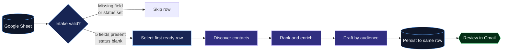

<div align="center">
  

  # Job Outreach Ops

  **Turn a complete job-tracking row into evidence-grounded recruiter, hiring-manager, and peer outreach drafts.**

  [](https://github.com/VikramKavuri/job-outreach-ops/actions/workflows/ci.yml)
  [](workflows/job-outreach-ops.json)
  [](LICENSE)
  [](#safety-model)

  [How it works](#how-a-run-actually-works) · [Quickstart](#quickstart) · [Architecture](docs/architecture.md) · [Node reference](docs/workflow-reference.md) · [Operations](docs/runbook.md)
</div>

---

Job Outreach Ops is a portable n8n workflow for deliberate, review-first job outreach. Google Sheets is the control plane: an operator supplies the company, role, location, job description, and resume; the workflow validates that contract before it spends quota or generates copy.

It then discovers likely contacts, ranks only the supplied search results, enriches selected profiles, writes audience-specific drafts, persists the result to the original row, and creates Gmail drafts. It does **not** send email automatically.

## How a run actually works

The current workflow starts manually in n8n. Filling a sheet row makes it *eligible*; clicking **Execute workflow** starts the run.



### Intake contract

A row enters outreach only when all five required fields contain non-whitespace values and `Status` is blank.

| Required sheet field | Why it is required |
|---|---|
| `Company Name` | Constrains search and message context to one employer |
| `Job Title` | Drives department inference, contact discovery, and message intent |
| `Location` | Prevents hard-coded geography and improves contact relevance |
| `Job Description` | Supplies the role requirements used for ranking and drafting |
| `My_resume` | Is the sole source for candidate experience and achievement claims |

Incomplete rows and rows with any status are logged and skipped. Of the eligible rows, the workflow processes the first one from top to bottom. This keeps each manual execution bounded and predictable.

### Execution path

| Stage | What happens | External calls |
|---|---|---:|
| 1. Read and validate | Read the worksheet, preserve its physical row, enforce the intake contract | 1 Sheets read |
| 2. Normalize | Resolve common header aliases into a stable job context | None |
| 3. Discover | Build one recruiter, one manager, and one peer X-ray query | 3 Google CSE requests |
| 4. Rank | Select up to four candidates per audience from returned URLs and snippets | 1 Gemini request |
| 5. Enrich | Fetch structured context for each selected LinkedIn profile | Up to 12 Apify requests |
| 6. Draft | Generate recruiter, manager, then peer drafts from job, resume, and enriched evidence | 3 Gemini requests |
| 7. Persist and review | Update the preserved physical sheet row and create Gmail drafts for contacts with email addresses | 3 Sheets updates; up to 12 drafts |

The drafting stages run sequentially. Recruiter drafts are persisted and queued first; when that loop finishes, manager drafting begins, followed by peer drafting. `Status` becomes `In Progress` during the first two stages and `Drafted` only after the peer stage is persisted.

For the complete 35-node execution graph and the reason each node exists, see the [workflow reference](docs/workflow-reference.md).

## Design principles

Job Outreach Ops favors explicit contracts and reviewable behavior over autonomous volume.

- **Sheet-first control plane.** The source row contains both the work request and its processing state.
- **Evidence before generation.** Search discovers candidates; ranking cannot create new URLs; enrichment supplies the context used by draft prompts.
- **Resume-grounded claims.** Candidate facts come from `My_resume`, not a hard-coded persona or model memory.
- **Bounded execution.** One job row, three search queries, four model calls, and at most twelve contacts per run.
- **Sequential checkpoints.** Each audience is persisted before the next audience starts, making partial progress visible.
- **Human-controlled delivery.** Gmail resources are statically validated as `draft`; sending remains an operator action.
- **Portable configuration.** Secrets and resource selectors are runtime environment references; n8n credential IDs and instance metadata are not committed.

## Safety model

Generative models can still produce incorrect copy. Job Outreach Ops reduces that risk; it does not claim to eliminate it.

| Risk | Control |
|---|---|
| Incomplete job context | Five-field admission gate before search or generation |
| Invented contacts | Ranking is restricted to URLs returned by Google CSE |
| Invented candidate claims | Draft prompts restrict claims to the supplied resume |
| Unsupported personalization | Low-temperature prompts require explicit profile evidence |
| Accidental delivery | Three Gmail nodes are enforced as draft-only in CI |
| Duplicate reruns | Non-empty `Status` rows are skipped |
| Wrong-row writes | Updates match n8n's preserved `row_number`, captured before filtering |
| Credential leakage | `$env` expressions, stripped bindings, repository-wide secret scanning |

Every draft still requires a person to verify the recipient, factual claims, tone, relevance, and lawful basis before sending.

## Quickstart

### Prerequisites

- A self-hosted n8n instance with Google Sheets, Gmail, and Google Gemini nodes
- Google Sheets OAuth2, Gmail OAuth2, and Gemini credentials configured in n8n
- Google Custom Search JSON API access and a Programmable Search Engine ID
- An Apify token with access to the configured LinkedIn profile actor
- Node.js 20+ for repository validation

### 1. Configure runtime values

Copy the variables from [`.env.example`](.env.example) into the environment of the n8n process:

```dotenv
GOOGLE_CSE_API_KEY=replace_me
GOOGLE_CSE_ID=replace_me
APIFY_API_TOKEN=replace_me
OUTREACH_SPREADSHEET_ID=replace_me
OUTREACH_SHEET_NAME=Outreach
```

n8n Cloud may restrict `$env` access. If so, replace those expressions through n8n's credential or configuration UI; do not commit literal secrets.

### 2. Import and bind

1. Import [`workflows/job-outreach-ops.json`](workflows/job-outreach-ops.json) into n8n.
2. Bind local Google Sheets, Gmail, and Gemini credentials.
3. Keep the workflow inactive until the synthetic verification passes.
4. Confirm the worksheet follows the [data contract](docs/data-contract.md).

### 3. Validate the repository

```powershell
npm run validate
```

The quality gate verifies JSON syntax, local links, secret patterns, graph reachability, required intake fields, environment references, and draft-only Gmail configuration.

### 4. Verify with one synthetic row

Populate all five required fields, leave `Status` blank, execute manually, and confirm:

1. the first complete row is selected;
2. three query categories run;
3. contacts and drafts return to the same physical sheet row;
4. Gmail contains drafts only; and
5. each factual statement is traceable to the row or enriched profile context.

Use the [operations runbook](docs/runbook.md) before processing personal data.

## Repository layout

```text
.
├── .github/                    # CI quality gate and pull-request contract
├── docs/
│   ├── architecture.md         # Boundaries, sequence, cost, and failure behavior
│   ├── workflow-reference.md   # Purpose and connectivity of all 35 nodes
│   ├── data-contract.md        # Sheet inputs, state, and generated columns
│   ├── runbook.md              # Deployment, verification, incidents, rollback
│   └── assets/                 # Animated, reduced-motion-aware project visual
├── scripts/
│   ├── sanitize-workflow.mjs   # Remove secrets and installation-specific metadata
│   ├── validate-workflow.mjs   # Enforce graph and workflow invariants
│   └── validate-repository.mjs # Validate the complete repository surface
└── workflows/job-outreach-ops.json # Portable, inactive n8n workflow export
```

## Known boundaries

- Execution is manually triggered; editing the sheet does not automatically start outreach.
- Search snippets and third-party profile data may be stale or incorrect.
- The configured Apify actor and Google CSE availability are external dependencies.
- There is no automatic retry, dead-letter queue, or transactional rollback across providers.
- `Status = In Progress` requires operator review and reset after a mid-run failure.
- Provider usage, scraping, privacy, and outreach must comply with applicable law and platform terms.

## Documentation

- [Architecture](docs/architecture.md) — event sequence, trust boundaries, cost model, and scaling path
- [Workflow reference](docs/workflow-reference.md) — every node, in execution order
- [Data contract](docs/data-contract.md) — canonical sheet schema and lifecycle fields
- [Runbook](docs/runbook.md) — release verification, operation, incidents, and rollback
- [Security policy](SECURITY.md) — credential handling and vulnerability reporting
- [Contributing](CONTRIBUTING.md) — change workflow and definition of done

## License

Job Outreach Ops is available under the [MIT License](LICENSE).
