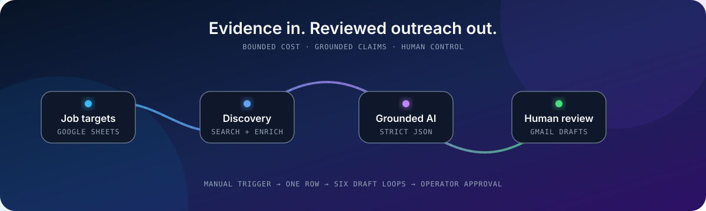
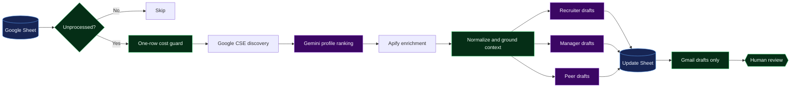

<div align="center">
  

  # Grounded Outreach Automation

  **A secure, review-first n8n pipeline that turns job targets into evidence-based Gmail drafts.**

  `54 nodes` · `7 grounded AI stages` · `6 draft-only outputs` · `0 committed credentials`
</div>

## Why this exists

Job outreach is repetitive, but blindly automating it creates generic messages, invented claims, and reputational risk. This workflow enriches one unprocessed job row at a time, grounds personalization in supplied resume and public profile data, and creates Gmail drafts for a human to approve.

> [!IMPORTANT]
> No generative system can guarantee zero hallucinations. This project reduces the risk with evidence-only prompts, low-temperature generation, structured JSON, bounded context, and a mandatory draft review gate.

## System flow



The detailed event sequence, failure boundaries, and trust model live in [Architecture](docs/architecture.md).

## Safety and efficiency by construction

| Concern | Repository control |
|---|---|
| Secret exposure | Runtime `$env` references, stripped credential IDs, automated secret-pattern scan |
| Unsupported claims | Evidence-only prompt policy and low temperature (`0.1–0.2`) |
| Accidental sending | Every Gmail node is validated as `resource: draft` |
| Runaway cost | One target row per run, truncated enrichment context, bounded output tokens |
| Wrong-row updates | Original sheet row is captured before filtering |
| Non-portable exports | Instance IDs, version IDs, cached resource locators, and credential bindings are removed |

## Quick start

Prerequisites: an n8n instance with the Google Sheets, Gmail, and Google Gemini nodes available, plus Google CSE and Apify access.

1. Copy `.env.example` into the environment used by your self-hosted n8n instance and replace every `replace_me` value.
2. Import [`workflows/outreach-automation.json`](workflows/outreach-automation.json).
3. Bind your own Google Sheets OAuth2, Gmail OAuth2, and Gemini credentials in n8n.
4. Confirm the sheet headers against [the data contract](docs/data-contract.md).
5. Execute manually with a test row, inspect the sheet update, then review the resulting Gmail drafts.

```powershell
npm run validate
```

n8n Cloud may restrict environment-variable access. In that case, replace each `$env.*` expression through the n8n credential/configuration UI—never commit a literal secret.

## Repository map

```text
.
├── .github/workflows/ci.yml       # JSON, topology, draft-mode, and secret checks
├── docs/
│   ├── architecture.md            # Components, event sequence, trust boundaries
│   ├── data-contract.md           # Required sheet inputs and generated outputs
│   ├── runbook.md                 # Deployment, verification, rollback, incidents
│   └── assets/outreach-flow.svg   # Reduced-motion-aware animated overview
├── scripts/
│   ├── sanitize-workflow.mjs      # Makes an n8n export safe and portable
│   └── validate-workflow.mjs      # Dependency-free CI policy gate
└── workflows/outreach-automation.json
```

## Security notice

The source export contained live-looking Google CSE and Apify credentials. They have been removed, but removal does not revoke them. Rotate both credentials before using this repository and review any remote Git history where the original file may have existed. See [SECURITY.md](SECURITY.md).

## Engineering notes

- The distributable workflow is intentionally inactive and manual-triggered.
- AI output is parsed as strict JSON, but human review remains required.
- Public profile enrichment can carry legal and platform-policy obligations; operate only with a valid basis and honor provider terms and deletion requests.
- “Production-ready” here means documented, testable, portable, and safely operable—not magically failure-proof.

Contributions are welcome through the process in [CONTRIBUTING.md](CONTRIBUTING.md).
