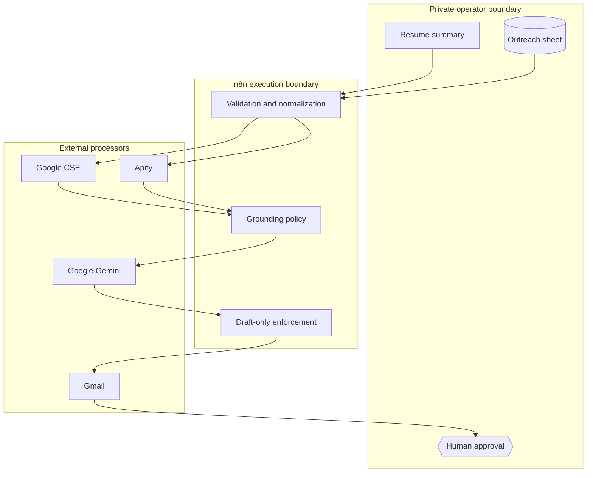

# Architecture

## Design goals

The system optimizes for four properties: evidence-grounded personalization, bounded spend, portable configuration, and human-controlled delivery. It is a single n8n workflow because the workload is orchestration-heavy and does not need a custom service boundary yet.

## Event sequence

```mermaid
sequenceDiagram
    autonumber
    actor Operator
    participant N as n8n
    participant S as Google Sheets
    participant C as Google CSE
    participant G as Gemini
    participant A as Apify
    participant M as Gmail

    Operator->>N: Manual execution
    N->>S: Read target rows
    S-->>N: Job, resume, and status columns
    N->>N: Preserve source row; filter; keep one row
    loop Bounded search queries
        N->>C: Discover candidate profile URLs
        C-->>N: Search results
    end
    N->>G: Rank profiles with structured output
    G-->>N: Recruiter, manager, and peer URLs
    N->>A: Enrich selected public profiles
    A-->>N: Profile and available contact data
    N->>N: Normalize, truncate, and attach evidence
    par Audience-specific drafting
        N->>G: Recruiter prompt
        N->>G: Manager prompt
        N->>G: Employee prompt
    end
    G-->>N: Strict JSON draft objects
    N->>S: Persist contacts and draft text
    N->>M: Create drafts only
    M-->>Operator: Human-review queue
```

## Processing stages

1. **Intake** — Google Sheets supplies the target company, role, job description, resume summary, and processing state.
2. **Admission control** — rows with an existing `Recruiter1_name` are skipped; the original row number is preserved before filtering; the Limit node keeps one row per execution.
3. **Discovery** — bounded search queries use Google CSE. Gemini turns search context into structured profile candidates.
4. **Enrichment** — Apify retrieves available profile context. Code nodes normalize URL identities, truncate long descriptions, and assemble compact evidence blocks.
5. **Generation** — audience-specific Gemini calls produce strict JSON. Temperatures are `0.1` for ranking and `0.2` for drafting; output budgets are capped by task size.
6. **Persistence** — contacts and generated subjects/bodies are written back to the originating sheet row.
7. **Delivery boundary** — Gmail creates drafts. The operator owns factual review, recipient verification, edits, and sending.

## Trust boundaries



External data is untrusted. Search snippets and profile fields may be stale, malformed, or adversarial. The workflow limits their size and instructs the model to treat only supplied facts as evidence, but the final review remains the authoritative control.

## Cost and latency model

The main variable costs are CSE requests, one Apify actor run, and seven Gemini calls. The one-row admission limit bounds each manual execution. Context is reduced before generation: experience descriptions are capped, summaries are truncated, and only recent experience is retained. Output budgets are 2,500 tokens for profile ranking, 3,000 for four recruiter drafts, and 1,600 for each manager/employee draft group.

For higher throughput, prefer measured concurrency and queue-mode n8n execution over increasing the row limit blindly. Track provider rate limits, p95 duration, successful drafts per row, and cost per approved draft.

## Failure behavior

| Failure | Effect | Recovery |
|---|---|---|
| Missing input column | Blank/partial context | Correct the sheet contract and rerun the row |
| CSE or Apify timeout | Run stops before drafting | Retry after provider recovery; inspect execution data |
| Invalid model JSON | Parser stage fails | Review prompt/model compatibility and rerun |
| Missing email | Contact is excluded from Gmail loop | Research manually or leave the contact unused |
| Sheet update failure | Draft creation should not be trusted | Correct permissions and rerun after checking duplicates |
| Gmail failure | Sheet may contain generated copy without a draft | Re-run only after inspecting existing drafts |

## Scaling path

If volume grows, split discovery, enrichment, generation, and draft creation into separate workflows connected by durable queues. Add idempotency keys based on sheet ID, row number, recipient, and job URL; store execution metrics; and define explicit retry/dead-letter policies. That complexity is intentionally deferred until workload evidence justifies it.
