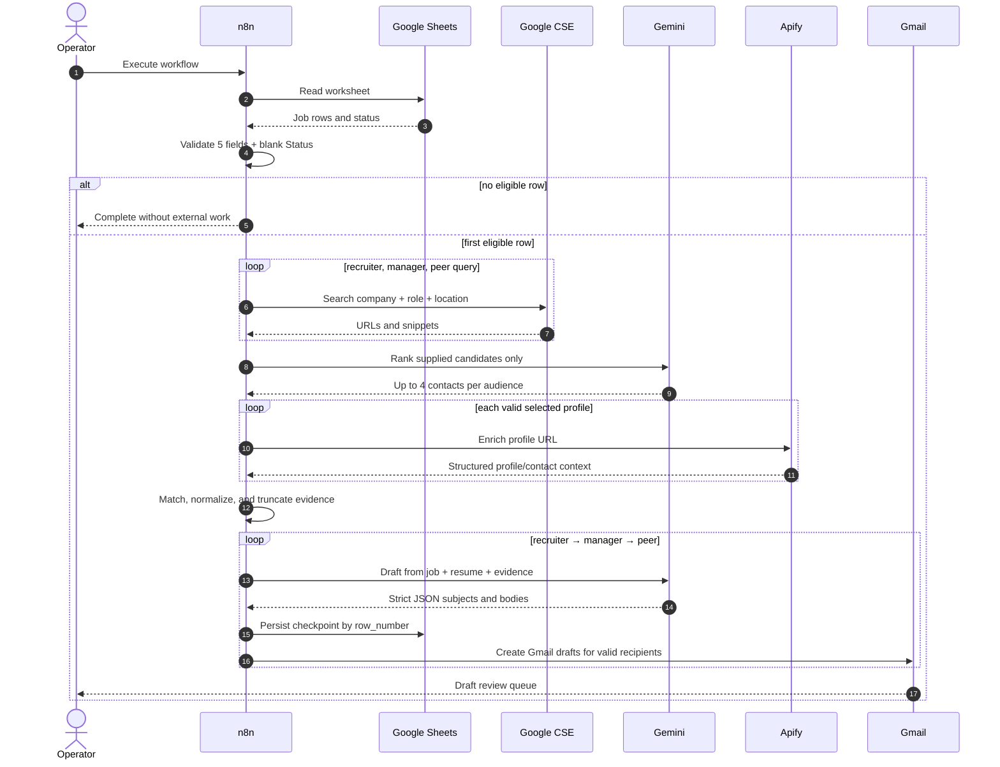
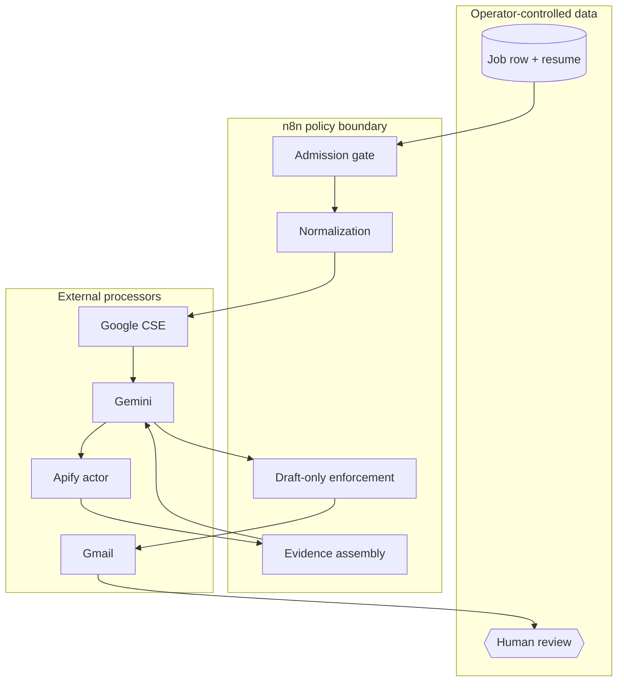
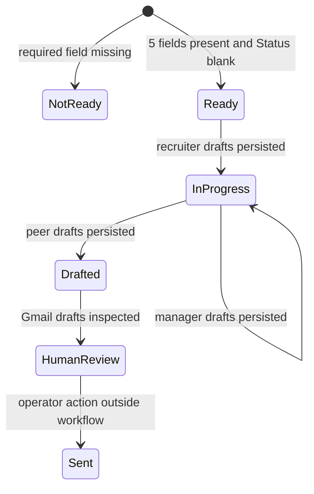

# Architecture

ContextReach is a single, manual-triggered n8n workflow. Google Sheets holds the work request and lifecycle state; external providers perform search, model inference, profile enrichment, and draft storage. The architecture deliberately ends before email delivery.

## Runtime sequence

## Control flow

The workflow is intentionally sequential at two levels:

1. Search queries run through one loop and aggregate only after all three audiences finish.
2. Audience drafting runs recruiter, manager, then peer. Each audience persists to Sheets and drains its Gmail draft loop before the next begins.

This design is slower than unconstrained fan-out but easier to inspect, rate-limit, and recover manually. One execution processes one eligible job row.

## Trust boundaries

Search snippets and enrichment data are untrusted. They may be stale, incomplete, malformed, or adversarial. ContextReach restricts ranking to supplied URLs, truncates profile context, uses low-temperature prompts, and requires human review. Those controls reduce risk; they do not establish factual truth.

## Work and cost envelope

For one eligible row, the designed upper bound is:

| Provider | Maximum designed work |
|---|---:|
| Google Sheets | 1 read + 3 audience updates |
| Google CSE | 3 searches |
| Gemini | 1 ranking + 3 drafting calls |
| Apify | 12 profile enrichment requests |
| Gmail | 12 draft creations |

Actual Apify and Gmail work can be lower when fewer supported profiles or email addresses are available. Ranking uses Gemini Flash with a 2,500-token output cap. Recruiter drafting uses Gemini Pro with a 3,000-token cap; manager and peer drafting use Flash with 1,600-token caps. Temperatures are `0.1` for ranking and `0.2` for drafting.

## State transitions

Any non-empty status is excluded from a new run. A failed `In Progress` row requires operator inspection and an intentional status reset before retrying; this prevents silent duplicate drafts.

## Failure boundaries

| Boundary | Observable effect | Operator response |
|---|---|---|
| Intake invalid | Row is logged and skipped | Complete missing fields; clear status only when retry is intentional |
| Search failure | No ranking or drafting | Inspect CSE credentials/quota and rerun one row |
| Ranking JSON invalid | Parser throws before enrichment | Inspect model output and prompt/model compatibility |
| Enrichment failure | Drafting does not receive complete context | Inspect actor result and selected URL; avoid blind retries |
| Audience draft JSON invalid | That audience is not persisted | Inspect execution data; correct and retry deliberately |
| Sheets update failure | Gmail stage for that audience does not begin | Restore permissions/schema before retry |
| Gmail draft failure | Sheet checkpoint may already exist | Check Gmail for partial drafts before retrying |

## Scaling path

The present graph optimizes for one-person operation, not bulk campaigns. If volume justifies expansion, split discovery, enrichment, generation, and draft creation into separate workflows with durable queues. Introduce idempotency keys based on spreadsheet ID, physical row, job URL, audience, and recipient; add retries with dead-letter handling; and measure cost per approved draft before increasing concurrency.
